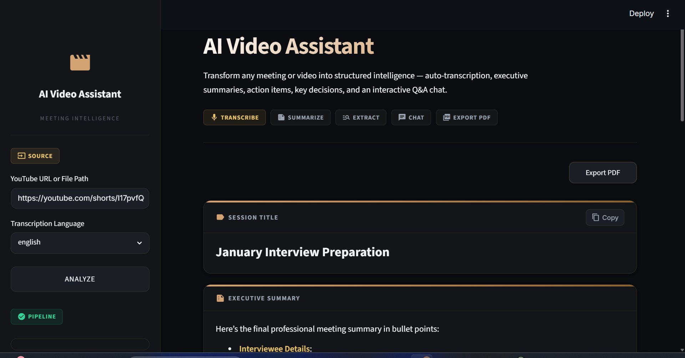
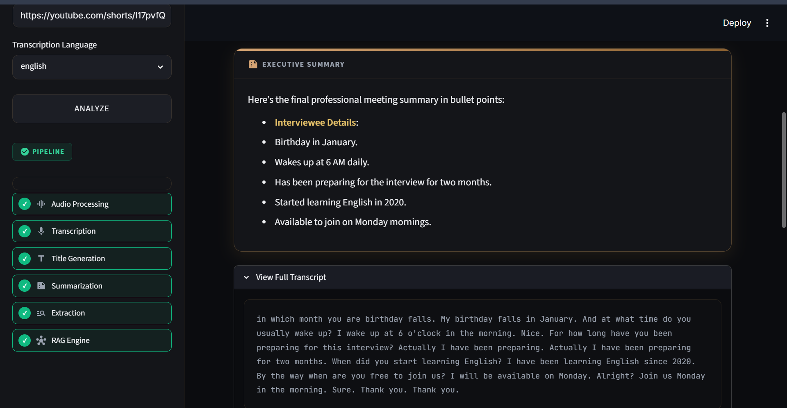
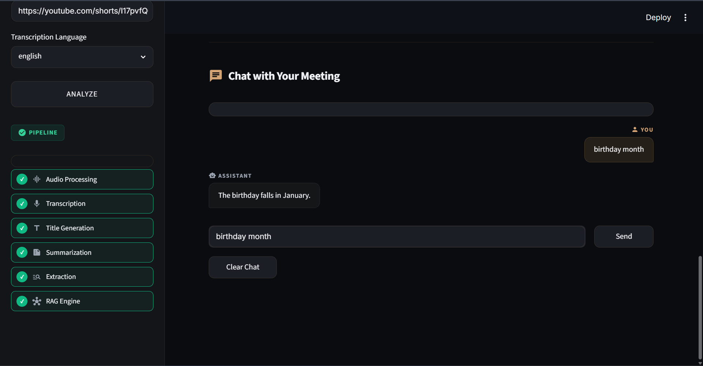

# AI Video Assistant

An AI-powered meeting intelligence application that converts videos or audio into searchable knowledge using **Speech-to-Text, LLMs, and Retrieval-Augmented Generation (RAG)**.
Users can upload a **YouTube link** or **local media file** to generate meeting summaries, extract key insights, and chat with the transcript.

---

## Demo

### Home Page



### Analysis Results



### AI Chat



---

## Features

- YouTube & Local File Support
- Speech-to-Text using Faster-Whisper
- AI-generated Meeting Summary
- Meeting Title Generation
- Action Item Extraction
- Key Decision Detection
- Open Question Identification
- RAG-powered Chat Assistant
- English & Hinglish Support

---

## Tech Stack

**Frontend**
- Streamlit

**AI**
- Mistral AI
- LangChain (LCEL)
- Faster-Whisper
- Sarvam AI

**Retrieval**
- ChromaDB
- HuggingFace Embeddings (all-MiniLM-L6-v2)

**Utilities**
- yt-dlp
- FFmpeg
- pydub

---

## Project Architecture

```
Input Video/Audio
        │
        ▼
Audio Processing
        │
        ▼
Speech-to-Text
        │
        ▼
Transcript
   ┌────┼────┐
   ▼    ▼    ▼
Summary Insights RAG
        │
        ▼
 Conversational Chat
```

---

## Getting Started

### Clone the repository

```bash
git clone https://github.com/yourusername/AI-Video-Assistant.git
cd AI-Video-Assistant
```

### Install dependencies

```bash
pip install -r requirements.txt
```

### Configure environment variables

Create a `.env` file:

```env
MISTRAL_API_KEY=your_key
SARVAM_API_KEY=your_key
```

### Run

```bash
streamlit run app.py
```

---

## Project Structure

```
AI-Video-Assistant/
├── app.py
├── core/
│   ├── transcriber.py
│   ├── summarizer.py
│   ├── extractor.py
│   ├── rag_engine.py
│   └── vector_store.py
├── utils/
└── vector_db/
```

---

## Future Improvements

- Speaker Diarization
- Live Meeting Support
- Multi-language Translation
- Meeting History
